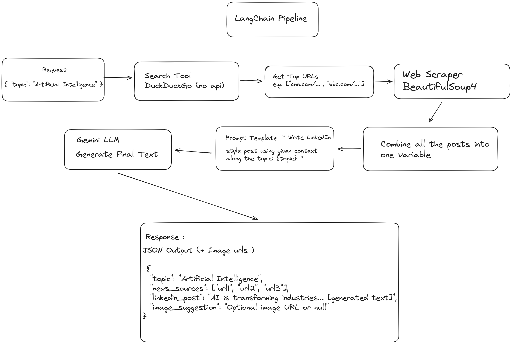

# **Demanual AI - LinkedIn Post Generator**

Demanual AI is a FastAPI-based application that automatically generates professional LinkedIn posts based on recent news articles related to a given topic. It scrapes relevant news, summarizes the content using a Google Gemini AI model, and provides a concise post along with a creative image suggestion.

---

## Features

- Accepts a topic and searches for recent news/articles.
    
- Scrapes the main textual content from the top links.
    
- Uses a Large Language Model (Google Gemini) to summarize content.
    
- Generates a professional LinkedIn post in a clear and engaging format.
    
- Provides a short, creative image suggestion for visual enhancement.
    
- Built with FastAPI and supports CORS for front-end integration.
    

---

## Requirements

- Python 3.11+
    
- FastAPI
    
- Pydantic
    
- LangChain (`langchain`, `langchain_core`, `langchain_community`)
    
- Requests
    
- BeautifulSoup4
    
- python-dotenv
    
- Uvicorn (for running locally)
    

---

## Installation

1. Clone the repository:
    
    ```bash
    git clone <repo_url>
    cd demanual-ai
    ```
    
2. Create a virtual environment and install dependencies:
    
    ```bash
    python -m venv venv
    source venv/bin/activate   # Linux/macOS
    venv\Scripts\activate      # Windows
    
    pip install fastapi uvicorn requests beautifulsoup4 python-dotenv langchain langchain_core langchain_community
    ```
    
3. Create a `.env` file in the root folder and add your API keys:
    
    ```env
    GOOGLE_API_KEY=your_google_api_key_here
    ```
    

---

## Usage

1. Run the FastAPI server locally, or access the deployed links `/docs`  SwaggerUI :
    
    ```bash
    python main.py
    ```
    
    The API will be accessible at: `http://localhost:8000` for localhosting
    
2. Send a POST request to `/generate-post` with a JSON body containing the topic:
    
    ```json
    {
        "topic": "Artificial Intelligence in Healthcare"
    }
    ```
    
3. The response will include:
    
    - `topic`: The requested topic.
        
    - `news_sources`: List of URLs scraped for content.
        
    - `linkedin_post`: The generated professional LinkedIn post including an image suggestion.
        

---

## Example Response

```json
{
  "topic": "Artificial Intelligence in Healthcare",
  "news_sources": [
    "https://example.com/article1",
    "https://example.com/article2"
  ],
  "linkedin_post": "LinkedIn Post: [Post content generated by AI] \nImage Suggestion: [Creative image suggestion]"
}
```

---

## Project Structure

```
├── main.py          # FastAPI server and endpoint
├── requirements.txt # Optional: for pip install
├── client.py (or html) # Optional: UI for ease of access (comming)
├── .env             # Environment variables (user needs to define)
├── README.md        # Project documentation
```

---
## Process flow

--- 
## Notes

- The application uses `DuckDuckGoSearchResults` to find relevant links.
    
- `BeautifulSoup` is used to scrape textual content from the pages.
    
- The LLM (Google Gemini 2.5) summarizes articles and generates posts.
    
- Designed for local testing; deploy on a server for production use.
    
